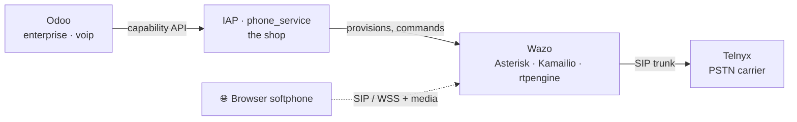

# Parrot VoIP Onboarding Course

A self-contained onboarding curriculum for engineers joining Odoo's VoIP team:
**13 short lessons in 4 modules** that take you from "what's a SIP?" to tracing a
purchase, a call, a voicemail and a charge across the whole Parrot stack —
enterprise `voip` → IAP `phone_service` → Wazo (Asterisk + Kamailio + rtpengine) → Telnyx.

!!! danger "Internal only"
    These lessons describe **unreleased architecture and security reasoning** for open PRs
    (odoo/enterprise#107700 · odoo/iap-apps#1370). Don't host or mirror them outside Odoo
    infrastructure.

!!! tip "Start here"
    **[▶ Open the interactive course](course/index.html)** — the lessons are self-contained
    HTML with in-browser retrieval exercises; the diagram libraries are vendored, so it works
    fully offline. Take them **in order** — each one leans on the previous — and do the
    exercises; that's where it sticks. Budget ~2½ hours total, in 8–12 minute sittings.

## What you come out able to do

| Module | Lessons | You come out able to… |
|---|---|---|
| **1 · The Map** | 1–3 | name the four machines, the golden rules, the two planes, and every SIP message in a call |
| **2 · A Call's Life** | 4–6 | trace outbound and inbound calls hop-by-hop, and argue why the Telnyx-direct world was replaced |
| **3 · The Machine Rooms** | 7–9 | explain the broker, structural tenancy, the 11-step floor build, and the webhook/robot reliability playbook |
| **4 · The Product** | 10–13 | walk a number purchase, routing (users/groups/queues), voicemail, and billing end-to-end |

## The lessons

### Module 1 · The Map
Who the machines are, the one mental model that organizes them, and the language they speak.

- **[Lesson 1 — Odoo becomes a phone company](course/lessons/0001-odoo-becomes-a-phone-company.html)** — the four machines behind a ringing browser tab, and the golden rules that keep them honest.
- **[Lesson 2 — The two planes: signaling vs media](course/lessons/0002-two-planes-signaling-vs-media.html)** — the one lens that makes Kamailio, Asterisk, rtpengine and Telnyx snap into place.
- **[Lesson 3 — The SIP call lifecycle](course/lessons/0003-sip-call-lifecycle.html)** — REGISTER → INVITE → 200 OK → ACK → BYE, plain words first, then the real names.

### Module 2 · A Call's Life
Follow real calls in both directions, then understand why the whole system was rebuilt this way.

- **[Lesson 4 — Outbound: calling the world](course/lessons/0004-outbound-calling-the-world.html)** — out the trunk door, with your number stamped on the envelope by the switchboard, not by you.
- **[Lesson 5 — Inbound: the world calls you](course/lessons/0005-inbound-the-world-calls-you.html)** — DID → incall → your browser rings, while the call card arrives through the shop.
- **[Lesson 6 — From Telnyx-direct to our own switchboard](course/lessons/0006-from-telnyx-direct-to-our-own-switchboard.html)** — why Parrot exists: what the migration killed, bought, and still owes us.

### Module 3 · The Machine Rooms
The broker, the tenant floors, and the event pipeline — the architecture you'll actually change.

- **[Lesson 7 — The shop: the broker in the middle](course/lessons/0007-the-shop-the-broker-in-the-middle.html)** — one keyholder, a capability API, and error keys as the contract.
- **[Lesson 8 — Your floor: tenancy & provisioning](course/lessons/0008-your-floor-tenancy-and-provisioning.html)** — eleven idempotent bricks and a doorbell; tenancy you can't escape.
- **[Lesson 9 — Doorbells & robots](course/lessons/0009-doorbells-and-robots.html)** — three webhook flavours, one dedup discipline, and the crons that heal everything.

### Module 4 · The Product
The features customers touch — buying, routing, voicemail, and the money underneath.

- **[Lesson 10 — Buying a number, end to end](course/lessons/0010-buying-a-number-end-to-end.html)** — coverage → paperwork → pay → the robots finish it while you go home.
- **[Lesson 11 — Desks, teams & waiting rooms](course/lessons/0011-desks-teams-and-waiting-rooms.html)** — users become Wazo users; queues get agents with priorities.
- **[Lesson 12 — Leaving a message](course/lessons/0012-leaving-a-message-voicemail.html)** — voicemail boxes, telephone-grade greetings, and push-the-metadata-pull-the-audio.
- **[Lesson 13 — Following the money](course/lessons/0013-following-the-money.html)** — an anonymous cost event becomes a charge; twice-bridged, once-charged, never doubled.

## Reference shelf

- **[📘 Onboarding Guide](course/reference/onboarding.html)** — the living source of truth every lesson cites (rendered from `parrot-onboarding.md`).
- **[📑 Glossary](course/reference/glossary.html)** — the canonical vocabulary, plane-tagged.

## Keeping it current

The course is generated against a specific state of the PRs — see the sync date in the course
home header (currently **2026-07-06**, enterprise `d416ce5b278` / iap-apps `0e0600ba`). When the
branches move substantially, the maintenance protocol lives in `docs/course/NOTES.md`; the short
version is to re-verify the course against the current branches, regenerate the onboarding guide,
and touch only the lessons the change invalidates.
