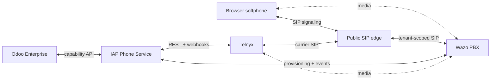

# Odoo VoIP Team Onboarding

A code-grounded course for engineers joining Odoo's VoIP team: **28 short core
lessons in 8 modules, plus focused field lessons**, from the Odoo framework and
contribution loop through Phone Service, IAP charging, Telnyx, Wazo, the SIP edge,
routing, calls, voicemail and billing.

!!! danger "Internal only"
    The course describes internal and unreleased architecture. Keep it on
    Odoo-approved infrastructure. The architecture is taught by stable
    repository/module ownership; verify the actual checkout and deployment
    target before making a release claim.

    Publication is blocked in the local Pages workflow until repository access
    and hosting are approved. This does not remove the existing public site or
    conceal already-pushed branches.

!!! tip "Start here"
    **[▶ Open the interactive course](course/index.html)**. Take the lessons in
    order and do the in-browser exercises. It works offline and assumes no prior
    Odoo or telecom knowledge. Budget about five hours plus the capstone.

```mermaid
flowchart LR
    B["Browser softphone"] <-->|"SIP signaling"| E["Public SIP edge"]
    B <-.->|"media"| W["Wazo PBX"]
    E <-->|"tenant-scoped SIP"| W
    O["Odoo Enterprise"] <-->|"capability API"| S["IAP Phone Service"]
    S <-->|"provisioning + events"| W
    S <-->|"REST + webhooks"| T["Telnyx"]
    T <-->|"carrier SIP"| E
    T <-.->|"media"| W
```

## Learning path

| Module | Lessons | Outcome |
|---|---:|---|
| Odoo as a platform | 1–3 | Trace a request and find the owning repository and addon |
| Writing Odoo code | 4–7 | Use the ORM, XML data, Owl and security boundaries correctly |
| The contribution loop | 8–11 | Test, run, debug and ship a focused Odoo change |
| The VoIP map | 12–14 | Name every component and separate signaling from media |
| A call's life | 15–17 | Trace inbound and outbound calls and explain the Parrot architecture |
| The machine rooms | 18–20 | Work with Phone Service, tenancy, provisioning, events and recovery |
| The product | 21–26 | Trace Buy Number, routing, queues, voicemail, charging, Call Flow and AI |
| Shipping VoIP work | 27–28 + field lessons | Diagnose across repositories, prepare a reviewer-ready contribution and review active features |

The interactive course home is the single canonical lesson map; lesson links are
kept there so this overview cannot drift when lessons are renamed.

## Reference shelf

- **[Onboarding guide](course/reference/onboarding.html)** — the detailed living architecture map.
- **[Source walkthrough](course/reference/source-walkthrough.html)** — planes first, slow authored code readings, then source-derived function execution cards with a freshness check.
- **[Repository and module map](course/reference/repo-module-map.html)** — ownership and contribution entry points.
- **[Debugging playbook](course/reference/debugging-playbook.html)** — one-identifier, boundary-first diagnosis.
- **[Contribution checklist](course/reference/contribution-checklist.html)** — the first-task handoff contract.
- **[VoIP glossary](course/reference/glossary.html)** — canonical Odoo and telecom vocabulary.

The current teaching baseline assumes the shared `voip-common` and
`phone-service-common` foundations, the `voip-boi` provisioning-policy work,
and the Community/Enterprise scheduled-call changes are integrated and
deployed through their normal release paths. The walkthrough deliberately
uses stable paths, symbols, ownership boundaries and re-find commands rather
than commit or line-number anchors.
