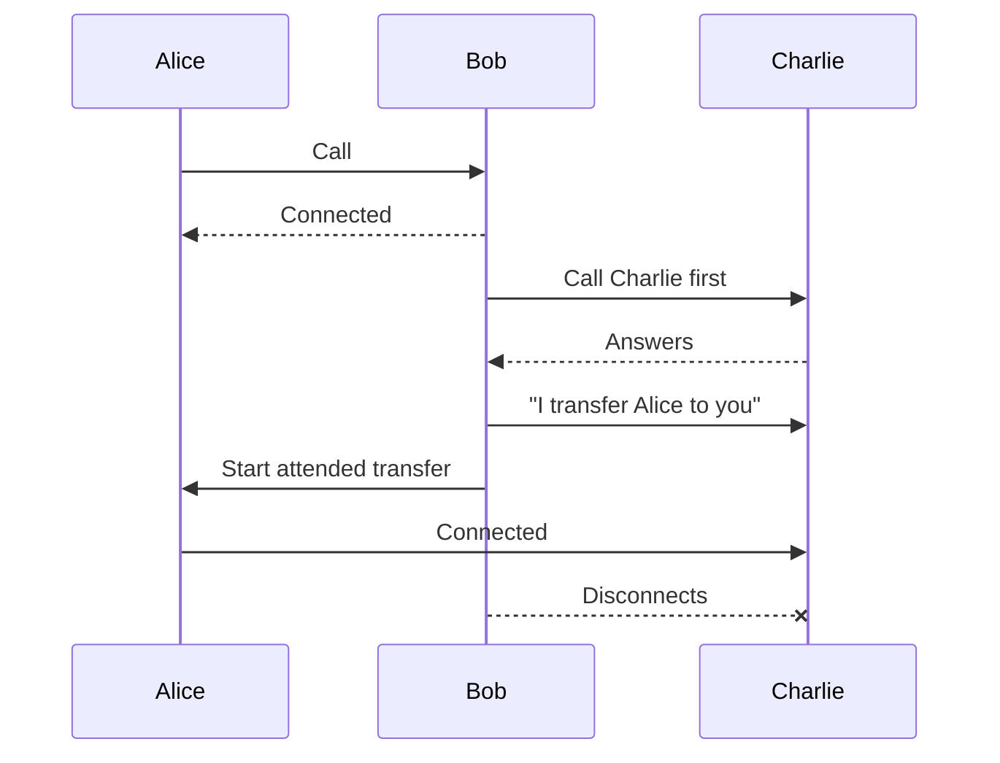
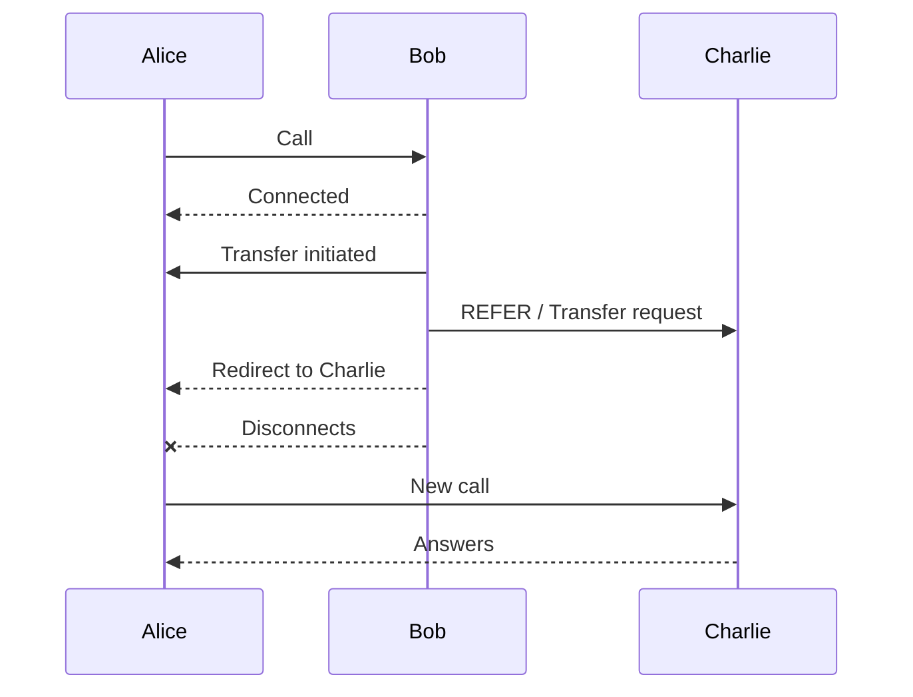

# Configuration options SIP trunk

## Endpoint

### 100rel

`[no|yes|required|peer_supported]` (default: yes)

`100rel` is about **reliable provisional SIP responses**.
Normally, SIP temporary responses like 180 Ringing (“the phone is ringing”) are sent unreliably over UDP.
With 100rel, these temporary responses must be acknowledged with a `PRACK` (Provisional Response Acknowledgement) message, so both sides know they were received. 

`100rel` is about **reliable provisional SIP responses**.
Normally, SIP temporary responses like `180 Ringing` (“the phone is ringing”) are sent unreliably over UDP.
With `100rel`, these temporary responses must be acknowledged with a `PRACK` message, so both sides know they were received.

The different values mean:

* `no`
  Do not support reliable provisional responses at all.

* `yes`
  Support them if the other side wants to use them.

* `required`
  Force the use of reliable provisional responses. Calls may fail if the peer does not support it.

* `peer_supported`
  Use reliable provisional responses only if the other side says it supports them.
  This is usually the safest and most compatible option.

### accept_multiple_sdp_answers

`[yes|no]` (default: no)

`accept_multiple_sdp_answers` allows Asterisk to accept updated SDP information during call setup.

Normally, SIP devices exchange SDP only once to decide:

* which codec to use
* which IP/port to send audio to

But some SIP servers change their media settings during ringing (`18x`) or when the call is answered (`200 OK`).

Example:

* first response → audio should go to port `10000`
* later response → audio should go to port `12000`

With this option enabled, Asterisk accepts the new SDP and updates the media destination.

This is useful with some providers that:

* use a special port for ringback tones
* move RTP streams during the call setup
* change media parameters before the call is fully established

In simple terms:

* Disabled:
  “I only trust the first SDP answer.”

* Enabled:
  “If the remote side changes media information during setup, I accept the update.”

### accountcode

`accountcode` is used to associate calls with a billing or tracking identifier.

When a call is made or received through this endpoint, Asterisk automatically attaches the specified account code to the channel.

This is commonly used for:

* billing
* call reporting
* statistics
* separating departments or customers

Example:

```ini
accountcode = sales
```

All calls from this endpoint will be marked with the account code `sales`.

In simple terms:

* It is like adding a label or tag to calls.
* Useful for tracking who made calls or which group the calls belong to.

### acl

`acl` is used to control which IP addresses are allowed or denied for this endpoint.

It references rules defined in the Asterisk configuration file `acl.conf`.

You can think of it as a firewall rule attached to the SIP endpoint.

Example:

```ini
acl = office_ips, trusted_provider
```

Asterisk will apply the rules from the `office_ips` and `trusted_provider` sections in `acl.conf`.

This is useful to:

* allow only trusted SIP servers or phones
* block unknown IP addresses
* improve security against SIP attacks

In simple terms:

* “Only these IP addresses are allowed to use this endpoint.”

### aggregate_mwi

`[yes|no]` (default: yes)

`aggregate_mwi` controls how voicemail notifications (MWI = Message Waiting Indicator) are sent to the phone.

If a phone monitors multiple mailboxes:

* Enabled (`yes`)
  Asterisk sends one combined notification for all mailboxes.

* Disabled (`no`)
  Asterisk sends one separate notification per mailbox.

Example:

A phone watches:

* mailbox 1000
* mailbox 1001
* mailbox 1002

With `aggregate_mwi=yes`:

* the phone receives one global “you have voicemail” notification.

With `aggregate_mwi=no`:

* the phone receives three individual notifications.

This can affect:

* compatibility with some phones
* network traffic
* how voicemail indicators are displayed

In simple terms:

* Enabled:
  “Group all voicemail notifications together.”

* Disabled:
  “Send one notification per mailbox.”

### allow

`allow` defines which audio codecs this endpoint is allowed to use during calls.

A codec is the format used to encode and compress audio.

Examples of codecs:

* `ulaw`
* `alaw`
* `g722`
* `opus`
* `g729`

Example:

```ini
allow = ulaw,alaw,g722
```

This endpoint can use:

* G.711 µ-law (`ulaw`)
* G.711 A-law (`alaw`)
* G.722 HD audio

During call negotiation, Asterisk and the remote device choose a codec supported by both sides.

This affects:

* audio quality
* bandwidth usage
* CPU usage (transcoding)

In simple terms:

* “These are the audio formats this endpoint accepts.”

[See codecs section](../media/codecs.md)

### allow_overlap

`[yes|no]` (default: yes)

`allow_overlap` enables overlap dialing support.

Normally, SIP sends the full phone number at once.

With overlap dialing, digits can be sent one by one, like on old telephone systems.

Example:

* user dials `1`
* then `10`
* then `100`
* then `1002`

Asterisk receives the number progressively instead of all at once.

This is defined by SIP RFC3578.

This is mainly useful for:

* interoperability with some telecom systems
* old PBX systems
* ISDN-style dialing behavior

Most modern SIP systems do not need this.

In simple terms:

* Disabled:
  “Send the complete number immediately.”

* Enabled:
  “Allow numbers to arrive digit by digit.”

### allow_subscribe

`[yes|no]` (default: yes)

`allow_subscribe` controls whether this endpoint is allowed to send SIP `SUBSCRIBE` requests to Asterisk.

`SUBSCRIBE` is used to ask for status updates.

Common examples:

* BLF (Busy Lamp Field)
* extension presence
* voicemail status
* phone status monitoring

Example:

* a phone subscribes to extension `1001`
* Asterisk sends notifications when `1001` becomes busy, ringing, or available

If disabled:

* the endpoint cannot monitor statuses through subscriptions

This is commonly used for:

* receptionist phones
* sidecar/BLF buttons
* presence features

In simple terms:

* Enabled:
  “This phone can ask Asterisk for status updates.”

* Disabled:
  “This phone is not allowed to monitor statuses.”

### allow_transfer

`[yes|no]` (default: yes)

`allow_transfer` controls whether this endpoint is allowed to use SIP call transfers with the `REFER` method.

A SIP `REFER` tells another device:

* “Please call this other number instead.”

This is how many SIP phones perform call transfers.

Example:

* Alice calls Bob
* Bob transfers Alice to Charlie
* Bob sends a SIP `REFER`

If enabled:

* the endpoint can perform SIP transfers

If disabled:

* transfer requests are rejected

This affects:

* attended transfers (consult the recipient before transferring the call)



* blind transfers (immediate transfer, no verification)



* interoperability with SIP phones/providers

In simple terms:

* Enabled:
  “This endpoint can transfer calls.”

* Disabled:
  “This endpoint cannot use SIP transfers.”

### allow_unauthenticated_options

`[yes|no]` (default: no)

`allow_unauthenticated_options` controls whether Asterisk accepts SIP `OPTIONS` requests without authentication.

`OPTIONS` is often used like a SIP “ping” to check:

* if a device is online
* if a SIP endpoint is reachable
* if the service is alive

Some SIP phones and providers expect a simple `200 OK` response without needing authentication.

If enabled:

* Asterisk answers `OPTIONS` requests even from unauthenticated sources

If disabled:

* authentication is required before answering

This improves compatibility with some SIP providers and monitoring systems.

However, there is a security risk:

* attackers may discover valid endpoint names
* they can scan your SIP server more easily

In simple terms:

* Enabled:
  “Anyone can ping this SIP endpoint.”

* Disabled:
  “You must authenticate before Asterisk answers OPTIONS requests.”

### aors

`aors` links a SIP endpoint to one or more AoRs (Address of Record).

An AoR represents where the endpoint can currently be reached.

It usually contains:

* the SIP contact address
* registered device locations
* IP addresses or SIP URIs

Example:

```ini
aors = phone1001
```

The endpoint uses the `phone1001` AoR to know where calls should be sent.

When a phone registers:

* the AoR stores its current contact address

Asterisk then uses the AoR to route calls to the correct device.

In simple terms:

* Endpoint = “who the device is”
* AoR = “where the device is currently reachable”

### asymmetric_rtp_codec

`[yes|no]` (default: no)

`asymmetric_rtp_codec` allows Asterisk to use different codecs for sending and receiving audio.

Normally, SIP tries to use the same codec in both directions.

Example (normal behavior):

* receive audio with `ulaw`
* send audio with `ulaw`

With this option enabled:

* receive audio with `opus`
* send audio with `g722`

Asterisk will not automatically switch its sending codec to match the received codec.

This can be useful with:

* unusual SIP devices
* some gateways/providers
* asymmetric media environments

But it may also:

* increase transcoding
* increase CPU usage
* create compatibility issues with some devices

In simple terms:

* Disabled:
  “Use the same codec in both directions.”

* Enabled:
  “Sending and receiving codecs may be different.”

### auth

`auth` defines which authentication rules are used to verify incoming SIP connections for this endpoint.

It references one or more `auth` sections defined elsewhere in `pjsip.conf`.

Example:

```ini
auth = phone1001-auth
```

When a SIP device tries to:

* register
* make a call
* connect to Asterisk

Asterisk checks the credentials using this authentication section.

Typically, the auth section contains:

* username
* password
* authentication method

If no `auth` is configured:

* the endpoint may accept connections without authentication
  (which is usually insecure)

In simple terms:

* “These are the login credentials required for this endpoint.”

### bind_rtp_to_media_address

`[yes|no]` (default: no)

`bind_rtp_to_media_address` controls which local IP address Asterisk uses to send RTP audio packets.

Normally, Asterisk automatically chooses the source IP address for audio traffic.

If `media_address` is configured and this option is enabled:

* RTP packets are explicitly sent from that IP address

This is especially useful on servers with:

* multiple network interfaces
* multiple public IPs
* NAT configurations

Example:

```ini
media_address = 34.53.141.129
bind_rtp_to_media_address = yes
```

Audio packets will be sent from `34.53.141.129`.

This helps avoid:

* one-way audio
* NAT problems
* incorrect RTP source IPs

In simple terms:

* Disabled:
  “Asterisk chooses the RTP source IP automatically.”

* Enabled:
  “Force RTP audio to be sent from the media_address IP.”

### bundle

`[yes|no]` (default: no)

`bundle` enables RTP bundling.

Normally, each media stream uses its own transport/port.

Example without bundle:

* audio RTP → port 10000
* video RTP → port 10002
* screen sharing → another port

With `bundle` enabled:

* multiple media streams share the same transport and port

This reduces:

* the number of UDP ports used
* network complexity
* NAT traversal issues

This feature is commonly used with:

* WebRTC
* modern browsers
* multimedia SIP sessions

When enabled, Asterisk also automatically enables `rtcp_mux`:

* RTP and RTCP will share the same port too

In simple terms:

* Disabled:
  “Each media stream uses separate ports.”

* Enabled:
  “Multiple media streams can share the same connection.”

### call_group

`call_group` assigns this endpoint to one or more call groups.

Call groups are used with pickup features:

* a phone can answer calls ringing in the same group

Example:

```ini
call_group = 1,3,10-12
```

This endpoint belongs to:

* group 1
* group 3
* groups 10 to 12

If another phone is allowed to pick up calls from these groups:

* it can answer ringing calls remotely

This is commonly used in:

* offices
* support teams
* reception environments

Example:

* Alice’s phone rings
* Bob is in the same pickup group
* Bob presses “pickup” and answers Alice’s call

In simple terms:

* “This endpoint belongs to these call pickup groups.”

### callerid

`callerid` defines the caller identity sent by this endpoint.

It usually contains:

* a display name
* a phone number

Format:

```ini
callerid = "Alice Smith" <1001>
```

When this endpoint makes a call:

* the called person may see:

  * `Alice Smith`
  * `1001`

You can also define only a number:

```ini
callerid = <1001>
```

Or only a name:

```ini
callerid = "Support Desk"
```

This affects:

* what appears on phones
* outbound caller identification
* call logs and displays

In simple terms:

* “This is the name and number shown during calls.”

### callerid_privacy

`callerid_privacy` defines the privacy level of the caller ID.

It tells the remote side whether:

* the caller ID can be shown
* the caller ID should be hidden
* the caller ID has been verified (“screened”)

The most common values are:

* `allowed`
  Caller ID may be displayed normally.

* `prohib`
  Caller ID should be hidden/private.

* `unavailable`
  Caller ID information is unavailable.

The “screened” variants indicate whether the caller ID was verified by the network:

* `passed_screen`
  The caller ID was verified.

* `failed_screen`
  Verification failed.

* `not_screened`
  No verification was performed.

Examples:

```ini
callerid_privacy = allowed
```

→ show the caller ID normally.

```ini
callerid_privacy = prohib
```

→ request anonymous/private caller ID.

In simple terms:

* “Should the caller ID be visible or hidden, and is it trusted?”

### callerid_tag

`callerid_tag` is an internal label attached to the endpoint’s caller ID.

It is mainly used internally by Asterisk for identification or custom logic.

Unlike `callerid`, this value is usually not shown to users during calls.

Example:

```ini
callerid_tag = sales_team
```

This can help:

* identify groups of endpoints
* apply custom dialplan logic
* simplify debugging or integrations

In simple terms:

* “An internal tag associated with this endpoint’s caller ID.”

### codec_prefs_incoming_answer

default : prefer: pending, operation: intersect, keep: all

The string actually specifies 4 'name:value' pair parameters separated by commas.

`codec_prefs_incoming_answer` controls how Asterisk chooses codecs when it receives an SDP answer from the remote side.

In SIP, both sides exchange codec lists during call setup.

Example:

Asterisk supports:

* `opus`
* `g722`
* `ulaw`

The remote device answers with:

* `ulaw`
* `alaw`

This option tells Asterisk:

* which list is preferred
* how to combine the lists
* whether to keep one codec or several

The important parameters are:

* `prefer`
  Which codec list has priority:

  * `pending` → prefer the remote SDP codecs
  * `configured` → prefer the endpoint codecs

* `operation`
  How to combine codec lists:

  * `intersect` → keep only codecs supported by both sides
  * `union` → merge both lists
  * `only_preferred` → keep only the preferred list

* `keep`
  How many codecs to keep:

  * `all` → keep all matching codecs
  * `first` → keep only the first codec

Example:

```ini
codec_prefs_incoming_answer = keep:first
```

Meaning:

* negotiate codecs normally
* but finally keep only the first selected codec

In simple terms:

* “This option controls how Asterisk chooses and prioritizes codecs when the remote side answers the call.”

### codec_prefs_incoming_offer

default: prefer: pending, operation: intersect, keep: all, transcode: allow

`codec_prefs_incoming_offer` controls how Asterisk handles codecs proposed by the remote side when receiving a call.

When an incoming SIP call arrives, the caller sends an SDP offer containing supported codecs.

Example:

Caller offers:

* `opus`
* `ulaw`
* `g729`

Endpoint configuration allows:

* `g722`
* `ulaw`
* `alaw`

This option tells Asterisk:

* which codec list has priority
* how to compare both lists
* whether transcoding is allowed

The main parameters are:

* `prefer`
  Which codec order should be preferred:

  * `pending` → prefer the caller’s codec order
  * `configured` → prefer the endpoint codec order

* `operation`
  How to compare the codec lists:

  * `intersect` → keep only codecs supported by both sides
  * `only_preferred` → keep only the preferred list

* `keep`
  How many codecs to keep:

  * `all` → keep all matching codecs
  * `first` → keep only the first codec

* `transcode`
  Whether transcoding is allowed:

  * `allow` → Asterisk may convert codecs
  * `prevent` → avoid codec conversion

Example:

```ini
codec_prefs_incoming_offer = prefer:pending, operation:intersect, keep:all
```

Meaning:

* prefer the caller’s codec order
* keep only codecs supported by both sides
* keep all compatible codecs

In simple terms:

* “This option controls how Asterisk chooses codecs when someone calls you.”

### codec_prefs_outgoing_answer

default: prefer: pending, operation: intersect, keep: all

`codec_prefs_outgoing_answer` controls how Asterisk chooses codecs when answering an outgoing SIP negotiation.

This happens when:

* Asterisk sends an SDP answer
* after receiving an SDP offer from the remote side

The option decides how to combine:

* codecs proposed by the Asterisk core (`pending`)
* codecs configured on the endpoint (`configured`)

Example:

Asterisk core proposes:

* `opus`
* `ulaw`

Endpoint allows:

* `g722`
* `ulaw`

This option determines:

* which list has priority
* which codecs are kept
* in which order

The important parameters are:

* `prefer`
  Which codec list should have priority:

  * `pending` → prefer codecs from the Asterisk core
  * `configured` → prefer endpoint codecs

* `operation`
  How to combine codec lists:

  * `intersect` → keep only codecs supported by both sides
  * `union` → merge codec lists
  * `only_preferred` → keep only the preferred list

* `keep`
  How many codecs remain:

  * `all` → keep all compatible codecs
  * `first` → keep only the first codec

Example:

```ini
codec_prefs_outgoing_answer = keep:first
```

Meaning:

* process codecs normally
* but finally keep only the first selected codec

In simple terms:

* “This option controls which codecs Asterisk sends back when negotiating an outgoing call.”

### codec_prefs_outgoing_offer

default: prefer: prefer: pending, operation: union, keep: all, transcode: allow

codec_prefs_outgoing_offer¶
Since: 18.0.0

This is a string that describes how the codecs specified in the topology that comes from the Asterisk core (pending) are reconciled with the codecs specified on an endpoint (configured) when sending an SDP offer. The string actually specifies 4 'name:value' pair parameters separated by commas. Whitespace is ignored and they may be specified in any order. Note that this option is reserved for future functionality.

Parameters:

prefer: < pending | configured > -

pending - The codec list from the core. (default)

configured - The codec list from the endpoint.

operation : < union | intersect | only_preferred | only_nonpreferred > -

union - Merge the lists with the preferred codecs first. (default)

intersect - Only common codecs with the preferred codecs first. (default)

only_preferred - Use only the preferred codecs.

only_nonpreferred - Use only the non-preferred codecs.

keep : < all | first > -

all - After the operation, keep all codecs. (default)

first - After the operation, keep only the first codec.

transcode : < allow | prevent > -

allow - Allow transcoding. (default)

prevent - Prevent transcoding.


Example:

codec_prefs_outgoing_offer = prefer: configured, operation: union, keep: first, transcode: prevent
Prefer the codecs coming from the endpoint. Merge them with the codecs from the core keeping the order of the preferred list. Keep only the first one. No transcoding allowed.

### connected_line_method

`[invite|reinvite|update]` (default: invite)

`connected_line_method` defines how Asterisk updates connected line information during a call.

Connected line information is the identity of the person currently connected.

Example:

* Alice calls a company
* the call is transferred to Bob
* the phone display updates to show “Bob”

Asterisk can send this update using:

* `INVITE` (re-INVITE)
* `UPDATE`

The options are:

* `invite` / `reinvite`

  * If the remote side supports `UPDATE`, use it
  * otherwise use a re-INVITE

  This is the safest and most compatible behavior.

* `update`

  * Always send SIP `UPDATE`
  * even if the remote side did not explicitly say it supports it

Using `UPDATE` is often preferred because:

* it avoids SDP renegotiation
* it is lighter than a re-INVITE

In simple terms:

* “How should Asterisk update the displayed caller information during a call?”

### contact_acl

`contact_acl` applies ACL (Access Control List) rules to SIP contact addresses.

It uses rules defined in `acl.conf`.

Unlike normal `acl`, which checks the source IP of SIP requests, `contact_acl` checks the IP addresses found inside SIP `Contact` headers.

This helps prevent devices from registering invalid or unauthorized contact addresses.

Example:

```ini
contact_acl = trusted_contacts
```

Asterisk will verify that contact addresses match the rules in the `trusted_contacts` ACL section.

This is useful for:

* improving SIP security
* preventing fake registrations
* filtering bad contact addresses

In simple terms:

* “Only allow SIP Contact addresses from trusted IP ranges.”

### contact_deny

`contact_deny` blocks specific IP addresses or networks from being used in SIP Contact addresses.

It is part of contact address filtering.

Example:

```ini
contact_deny = 192.168.1.50,10.0.0.0/24
```

This means:

* deny the single IP `192.168.1.50`
* deny the whole network `10.0.0.x`

Asterisk checks the IP addresses found in SIP `Contact` headers and rejects matching ones.

This helps:

* improve security
* prevent invalid registrations
* block unwanted devices or networks

In simple terms:

* “Reject SIP Contact addresses coming from these IPs or networks.”

### contact_permit

`contact_permit` allows only specific IP addresses or networks in SIP Contact addresses.

It is the opposite of `contact_deny`.

Example:

```ini
contact_permit = 192.168.1.0/24,10.0.0.5
```

This means:

* allow all devices in the `192.168.1.x` network
* allow the single IP `10.0.0.5`

Asterisk checks the IP addresses inside SIP `Contact` headers and accepts only matching ones.

This is useful for:

* restricting registrations to trusted networks
* improving SIP security
* preventing fake or malicious contact addresses

In simple terms:

* “Only allow SIP Contact addresses from these IPs or networks.”

### contact_user

`contact_user` forces the username part of the SIP `Contact` header on outgoing requests.

In SIP, a Contact header looks like this:

```text
Contact: <sip:1001@192.168.1.10:5060>
```

The `user` part here is:

* `1001`

With `contact_user`, you can force that value.

Example:

```ini
contact_user = trunk001
```

Outgoing SIP messages will use:

```text
Contact: <sip:trunk001@...>
```

This is sometimes required by:

* SIP providers
* SBCs
* trunks expecting a specific Contact username

In simple terms:

* “Force a custom username inside the SIP Contact header.”

### context

`context` defines which dialplan context handles incoming calls for this endpoint.

When Asterisk receives a call from this endpoint:

* it sends the call into the specified dialplan context

The context determines:

* which extensions can be called
* what the caller is allowed to do
* how the call is processed

Example:

```ini
context = internal
```

Incoming calls from this endpoint enter the `internal` context in the dialplan.

This is very important for:

* routing calls
* separating users
* security

Example:

* phones → `internal`
* SIP trunks → `from-provider`
* guests → restricted context

In simple terms:

* “This is the dialplan section where incoming calls from this endpoint will start.”

### cos_audio

`cos_audio` defines the Class of Service (CoS) priority for audio RTP packets.

It is a QoS (Quality of Service) setting used on networks that support traffic prioritization.

The goal is to give voice traffic higher priority than normal data traffic.

Example:

* prioritize phone calls over file downloads

This value is usually written into Ethernet VLAN priority fields (802.1p).

Typical values:

* `0` → normal traffic
* `5` → commonly used for voice traffic

Example:

```ini
cos_audio = 5
```

This tells network equipment:

* “audio packets are important, prioritize them”

This helps reduce:

* latency
* jitter
* audio interruptions

In simple terms:

* “Set the network priority level for voice audio packets.”

### cos_video

`cos_video` defines the Class of Service (CoS) priority for video RTP packets.

It is a QoS (Quality of Service) setting used to prioritize video traffic on the network.

This helps network equipment recognize that video traffic is important.

Example:

* video calls can be prioritized over normal internet traffic

Typical values:

* `0` → normal priority
* higher values → higher priority

Example:

```ini
cos_video = 4
```

This tells switches and routers:

* “video packets should receive higher network priority”

This can help reduce:

* video lag
* packet loss
* jitter during video calls

In simple terms:

* “Set the network priority level for video traffic.”

### deny

`deny` blocks specific IP addresses or networks from connecting to this SIP endpoint.

It works like a small firewall rule inside Asterisk.

Example:

```ini
deny = 192.168.1.50,10.0.0.0/24
```

This means:

* block the IP `192.168.1.50`
* block all IPs in the `10.0.0.x` network

This is commonly used to:

* block unwanted devices
* improve SIP security
* restrict access to trusted networks only

`deny` is usually combined with `permit`.

In simple terms:

* “Reject connections from these IP addresses or networks.”

### device_state_busy_at

This option controls when Asterisk considers an endpoint as “busy”.

Normally:

* if a phone already has a call, its state becomes `INUSE`

With `device_state_busy_at`, you can define a threshold:

* after a certain number of simultaneous calls
* the device state becomes `BUSY`

Example:

```ini
device_state_busy_at = 2
```

Meaning:

* 1 active call → `INUSE`
* 2 active calls or more → `BUSY`

This is useful for:

* BLF indicators
* call queues
* receptionist phones
* limiting simultaneous calls

In simple terms:

* “After this number of active calls, consider the endpoint busy.”

### direct_media_glare_mitigation

Default: `none`

This option helps avoid SIP “glare” problems during direct media setup.

**First: what is direct media?**

Normally:

```text
Phone A ↔ Asterisk ↔ Phone B
```

Audio passes through Asterisk.

With direct media:

```text
Phone A ↔ Phone B
```

The phones send audio directly to each other.

To establish this, SIP devices exchange re-INVITEs.

**What is SIP glare?**

“Glare” happens when:

* both sides send a re-INVITE at the same time

Result:

* SIP conflict
* slower call setup
* failed direct media negotiation

**This option reduces that problem**

It decides which side is allowed to initiate direct media re-INVITEs.

Options:

* `none`

  * no glare mitigation
  * both sides may send re-INVITEs

* `outgoing`

  * prevent outgoing calls from initiating direct media re-INVITEs
  * incoming side handles them

* `incoming`

  * prevent incoming calls from initiating direct media re-INVITEs
  * outgoing side handles them

---

In simple terms:

* “Choose which side is allowed to start direct media negotiation, to avoid SIP collisions.”

### direct_media_method

Default: `invite`

`direct_media_method` defines which SIP method Asterisk uses when setting up direct media.

Direct media means that Asterisk tries to move the audio path from:

```text
Phone A ↔ Asterisk ↔ Phone B
```

to:

```text
Phone A ↔ Phone B
```

To do that, Asterisk must update the SIP session.

Possible values:

* `invite`
  Use a SIP re-INVITE.

* `reinvite`
  Same as `invite`.

* `update`
  Use SIP UPDATE.

In practice:

* `invite` / `reinvite` is the classic and most common behavior.
* `update` can be useful with devices that support SIP UPDATE well.

In simple terms:

* “Choose how Asterisk asks phones to send media directly to each other.”

### dtls_auto_generate_cert

Default: `no`

`[yes|no]`

`dtls_auto_generate_cert` tells Asterisk whether it may automatically generate a certificate for DTLS media encryption.

This only matters when:

* `media_encryption = dtls`
* or `webrtc = yes`

DTLS is commonly used by WebRTC clients to encrypt RTP media.

If enabled:

* Asterisk can create a temporary certificate automatically
* this is convenient for simple WebRTC setups

If disabled:

* you must provide certificate files yourself

In simple terms:

* “Let Asterisk create a DTLS certificate automatically when one is needed.”

### dtls_ca_file

`dtls_ca_file` points to a CA certificate file used to verify DTLS certificates.

This only applies when:

```ini
media_encryption = dtls
```

It is used when you want Asterisk to verify that the remote certificate was issued by a trusted authority.

This is uncommon in simple SIP trunk setups, but may matter in stricter WebRTC or enterprise environments.

In simple terms:

* “Use this CA file to check whether the remote DTLS certificate is trusted.”

### dtls_ca_path

`dtls_ca_path` points to a directory containing CA certificates for DTLS verification.

This is similar to `dtls_ca_file`, but instead of one file, it uses a directory.

This only applies when:

```ini
media_encryption = dtls
```

In simple terms:

* “Look in this directory for trusted CA certificates used by DTLS.”

### dtls_cert_file

`dtls_cert_file` points to the certificate file Asterisk presents for DTLS.

This only applies when:

```ini
media_encryption = dtls
```

It is commonly used for:

* WebRTC endpoints
* DTLS-SRTP media encryption
* deployments where you do not want auto-generated certificates

Example:

```ini
dtls_cert_file = /etc/asterisk/keys/asterisk.crt
```

In simple terms:

* “This is the certificate Asterisk uses for encrypted WebRTC-style media.”

### dtls_cipher

`dtls_cipher` restricts which TLS/DTLS ciphers may be used.

This only applies when:

```ini
media_encryption = dtls
```

You normally leave this unset unless you have a security policy that requires specific ciphers.

Example:

```ini
dtls_cipher = ECDHE-ECDSA-AES128-GCM-SHA256
```

Be careful:

* too strict a value can break compatibility
* weak ciphers should not be enabled

In simple terms:

* “Limit which encryption algorithms DTLS is allowed to use.”

### dtls_fingerprint

`[SHA-256|SHA-1]`

`dtls_fingerprint` defines which hash algorithm is used for DTLS certificate fingerprints.

A fingerprint is a short cryptographic identifier for a certificate.

Common value:

```ini
dtls_fingerprint = SHA-256
```

`SHA-256` is the modern choice.

`SHA-1` exists for compatibility with older systems, but should generally be avoided when possible.

In simple terms:

* “Choose the hash used to identify the DTLS certificate.”

### dtls_private_key

`dtls_private_key` points to the private key matching `dtls_cert_file`.

This only applies when:

```ini
media_encryption = dtls
```

Example:

```ini
dtls_private_key = /etc/asterisk/keys/asterisk.key
```

The private key must be protected carefully.

In simple terms:

* “This is the private key for Asterisk’s DTLS certificate.”

### dtls_rekey

Default: `0`

`dtls_rekey` controls whether DTLS keys are periodically refreshed.

The value is a number of seconds.

Example:

```ini
dtls_rekey = 3600
```

This means:

* refresh DTLS keys every hour

If unset or set to `0`:

* rekeying is disabled

In simple terms:

* “Decide whether encrypted media keys should be renewed during long calls.”

### dtls_setup

`[active|passive|actpass]`

`dtls_setup` defines which side starts the DTLS handshake.

Possible values:

* `active`
  Asterisk starts the DTLS connection.

* `passive`
  Asterisk waits for the remote side to start.

* `actpass`
  Asterisk offers both possibilities.

For WebRTC, `actpass` is commonly used.

In simple terms:

* “Choose who starts the DTLS encryption handshake.”

### dtls_verify

Default: `no`

`[no|fingerprint|certificate|yes]`

`dtls_verify` controls how strictly Asterisk verifies the remote DTLS certificate.

Possible values:

* `no`
  Do not verify the remote certificate.

* `fingerprint`
  Verify the certificate fingerprint.

* `certificate`
  Verify the certificate itself.

* `yes`
  Verify both fingerprint and certificate.

For WebRTC, fingerprint verification is common.

In simple terms:

* “Choose how much Asterisk should trust-check the remote DTLS certificate.”

### dtmf_mode

Default: `rfc4733`

`[rfc4733|inband|info|auto|auto_info]`

`dtmf_mode` defines how DTMF digits are sent.

DTMF means keypad tones:

* press `1` for sales
* enter a PIN
* navigate voicemail menus

Possible values:

* `rfc4733`
  Sends digits outside the audio stream using RTP events.

* `inband`
  Sends digits as real audio tones.

* `info`
  Sends digits using SIP INFO messages.

* `auto`
  Prefer RFC 4733, fall back to inband.

* `auto_info`
  Prefer RFC 4733, fall back to SIP INFO.

Common choice:

```ini
dtmf_mode = rfc4733
```

In simple terms:

* “Choose how keypad digits are transmitted during a call.”

### fax_detect

Default: `no`

`[yes|no]`

`fax_detect` enables detection of fax tones during a call.

If Asterisk detects a fax CNG tone:

* the call can be sent to the `fax` extension
* the dialplan can handle it as a fax call

This is useful when:

* the same number receives voice and fax
* you still support legacy fax devices

In simple terms:

* “Listen for fax tones and route the call as fax when detected.”

### fax_detect_timeout

Default: `0`

`fax_detect_timeout` limits how long Asterisk listens for fax tones.

The value is in seconds.

Example:

```ini
fax_detect_timeout = 10
```

This means:

* listen for fax tones for the first 10 seconds of the call
* then stop checking

If set to `0`:

* no timeout is applied

In simple terms:

* “Only try to detect fax for this many seconds.”

### follow_early_media_fork

Default: `yes`

`[yes|no]`

`follow_early_media_fork` controls how Asterisk handles early media when an outgoing INVITE is forked.

Forking means:

* one call attempt is sent to multiple destinations
* more than one destination may send ringing or early media

Some providers may send different SDP information in later `18x` or `2xx` responses.

If enabled:

* Asterisk may follow the newer media information when the response belongs to a different fork

This can help with:

* providers that fork calls internally
* early media from carrier platforms
* changed RTP ports before answer

In simple terms:

* “When a provider forks a call, follow the active early-media branch.”

### follow_redirect_methods

`follow_redirect_methods` defines which SIP methods are allowed to follow SIP redirects.

The value is a comma-separated list.

Example:

```ini
follow_redirect_methods = MESSAGE
```

Currently this is mainly relevant for SIP `MESSAGE`.

If a redirect is received for a method not listed here:

* Asterisk will not follow that redirect

In simple terms:

* “Only follow SIP redirects for these request types.”

### force_avp

Default: `no`

`[yes|no]`

`force_avp` forces Asterisk to use AVP-style RTP profiles in media offers.

RTP profiles describe how media is transported.

This can affect compatibility with:

* older SIP devices
* WebRTC-style media
* SRTP negotiation

If enabled:

* Asterisk uses AVP, AVPF, SAVP, or SAVPF profiles for all offers and updates

If disabled:

* Asterisk chooses the profile based on the endpoint configuration

In simple terms:

* “Force a specific family of RTP transport profiles.”

### g726_non_standard

Default: `no`

`[yes|no]`

`g726_non_standard` enables the non-standard AAL2 packing order for G.726 audio.

This is only relevant when:

* G.726 is negotiated
* the remote device expects the AAL2 packing order

If enabled, you should allow the matching codec:

```ini
allow = g726aal2
```

Most modern deployments do not need this.

In simple terms:

* “Use the older/non-standard G.726 packet format for devices that require it.”

### geoloc_incoming_call_profile

`geoloc_incoming_call_profile` applies a geolocation profile to calls received from this endpoint.

This is used before the call is sent to the dialplan.

It is mainly useful for:

* emergency calling
* regulatory location handling
* provider integrations that include location data

Example:

```ini
geoloc_incoming_call_profile = office_location
```

In simple terms:

* “Apply this location profile to calls coming from this endpoint.”

### geoloc_outgoing_call_profile

`geoloc_outgoing_call_profile` applies a geolocation profile to calls sent to this endpoint.

This is used after the dialplan sends the call to PJSIP and before it goes to the remote side.

Example:

```ini
geoloc_outgoing_call_profile = emergency_location
```

This is mainly useful for:

* emergency calls
* SIP providers that require location information
* multi-site deployments

In simple terms:

* “Attach this location profile to calls going out through this endpoint.”

### identify_by

Default: `username,ip`

`identify_by` defines how Asterisk determines which endpoint an incoming SIP request belongs to.

This is extremely important because when a SIP packet arrives, Asterisk must answer the question:

> “Which endpoint configuration should I use for this request?”

This option tells Asterisk which information to inspect in SIP messages.

You can enable one or multiple identification methods.

Example:

```ini
identify_by = username,ip
```

Asterisk will try:

1. username matching
2. IP matching

**Main identification methods**

**`username`**

Asterisk identifies the endpoint using:

* the SIP username
* usually found in the `From` header

Example:

```text
From: <sip:1001@pbx.example.com>
```

Asterisk tries to match:

* `1001`

This is very common for:

* SIP phones
* authenticated users
* softphones

Important:

This method is often used together with registrations.

**`auth_username`**

Asterisk identifies the endpoint using:

* the username from the SIP Authentication header

Example:

```text
Authorization: Digest username="1001"
```

This is useful when:

* the authentication username differs from the From header
* providers authenticate with special usernames

Important security note:

The Authentication header does not exist in the first SIP request:

* the client first sends a request
* Asterisk responds with `401 Unauthorized`
* then the client resends the request with authentication

So endpoint identification may happen later.

This can slightly delay attack detection.

**`ip`**

Asterisk identifies the endpoint using:

* the source IP address of the SIP packet

Example:

```ini
identify_by = ip
```

Typical usage:

* SIP trunks
* providers with fixed IPs
* server-to-server SIP connections

Very common with:

* Telnyx
* Twilio
* SIP carriers

In this case:

* authentication may not even be required
* the IP itself is trusted

**`header`**

Asterisk identifies the endpoint using:

* a specific SIP header value

Useful for:

* advanced routing
* SBC integrations
* custom SIP infrastructures

**`request_uri`**

Asterisk identifies the endpoint using:

* the SIP Request-URI

Example:

```text
INVITE sip:sales@pbx.example.com SIP/2.0
```

Useful for:

* multi-tenant systems
* advanced SIP routing

**Registration importance**

This option also affects SIP registrations.

When a device registers:

* Asterisk must determine which AOR/endpoint the REGISTER belongs to

If no compatible identification method exists:

* registration may fail

**Typical real-world examples**

**SIP phone**

```ini
identify_by = username,auth_username
```

**SIP trunk provider**

```ini
identify_by = ip
```

**Mixed configuration**

```ini
identify_by = username,ip
```

In simple terms:

* “How should Asterisk recognize who is sending this SIP message?”

### ignore_183_without_sdp

Default: `no`

`[yes|no]`

`ignore_183_without_sdp` tells Asterisk to ignore `183 Session Progress` responses that do not contain SDP.

Normally, `183 Session Progress` can be used for early media.

But if there is no SDP:

* there is no media information
* forwarding it may break ringback behavior with some networks

This is useful for:

* SS7/SIP interworking
* providers that send unhelpful `183` responses
* avoiding lost ringback tone

In simple terms:

* “Ignore empty 183 responses so callers still hear proper ringing.”

### inband_progress

Default: `no`

`[yes|no]`

`inband_progress` controls whether Asterisk sends ringing as early media.

If enabled:

* Asterisk sends `183 Session Progress`
* ringing is sent as audio

If disabled:

* Asterisk sends `180 Ringing`
* ringing is signaled, not sent as audio

This affects what the caller hears during call setup.

In simple terms:

* “Decide whether ringing is sent as an audio stream or just as SIP signaling.”

### incoming_call_offer_pref

Default: `local`

`[local|local_first|remote|remote_first]`

`incoming_call_offer_pref` controls codec preference for incoming SDP offers.

It compares:

* the codecs offered by the remote side
* the codecs configured in `allow`

Only codecs present in both lists are used.

Possible values:

* `local`
  Use the endpoint’s codec order.

* `local_first`
  Use only the first matching local codec.

* `remote`
  Use the remote side’s codec order.

* `remote_first`
  Use only the first matching remote codec.

Example:

```ini
incoming_call_offer_pref = local
```

In simple terms:

* “When someone calls us, decide whose codec preference wins.”

### incoming_mwi_mailbox

`incoming_mwi_mailbox` defines which mailbox should receive MWI status from this endpoint.

MWI means Message Waiting Indicator.

If this endpoint sends an MWI NOTIFY:

* Asterisk maps that status to this mailbox

If unset:

* incoming MWI NOTIFY messages are ignored

Example:

```ini
incoming_mwi_mailbox = 1001@default
```

In simple terms:

* “When this endpoint tells us voicemail status, store it on this mailbox.”

### mailboxes

`mailboxes` defines which voicemail mailboxes should trigger MWI notifications to this endpoint.

Example:

```ini
mailboxes = 1001@default,1002@default
```

When one of these mailboxes changes:

* Asterisk sends a voicemail waiting notification to the endpoint

This is commonly used for:

* desk phones
* shared voicemail indicators
* BLF/voicemail lamps

In simple terms:

* “Tell this phone which voicemail boxes it should watch.”

### max_audio_streams

Default: `1`

`max_audio_streams` limits how many audio streams can be negotiated with this endpoint.

Most normal calls use:

* one audio stream

More advanced sessions may have multiple streams.

Example:

```ini
max_audio_streams = 1
```

In simple terms:

* “Limit how many audio streams this endpoint may use at once.”

### max_video_streams

Default: `1`

`max_video_streams` limits how many video streams can be negotiated with this endpoint.

Example:

```ini
max_video_streams = 1
```

This is useful for:

* disabling video by setting it to `0`
* allowing one video stream
* controlling resource usage

In simple terms:

* “Limit how many video streams this endpoint may use at once.”

### media_address

`media_address` defines the IP address Asterisk puts in SDP for media streams.

SDP tells the remote side:

* where to send RTP audio/video

Example:

```ini
media_address = 203.0.113.10
```

This is useful when:

* Asterisk is behind NAT
* Asterisk has multiple network interfaces
* media should be advertised on a specific public IP

Be aware:

* the transport option `external_media_address` may also affect the final SDP address

In simple terms:

* “Tell the remote side which IP address to send media to.”

### media_encryption

Default: `no`

`[no|sdes|dtls]`

`media_encryption` controls whether RTP media is encrypted.

Possible values:

* `no`
  Do not use media encryption.

* `sdes`
  Use SRTP keys exchanged inside SDP.

* `dtls`
  Use DTLS-SRTP, common for WebRTC.

Important:

* with `sdes`, use encrypted SIP transport such as TLS, because keys are carried in signaling
* WebRTC normally uses `dtls`

In simple terms:

* “Choose whether and how audio/video media should be encrypted.”

### media_encryption_optimistic

Default: `no`

`[yes|no]`

`media_encryption_optimistic` makes Asterisk more flexible when negotiating encrypted media.

This only applies when:

```ini
media_encryption = sdes
```

or:

```ini
media_encryption = dtls
```

It can help with endpoints that do not negotiate encryption exactly as expected.

In simple terms:

* “Try to accept encrypted media negotiation more flexibly.”

### media_use_received_transport

Default: `no`

`[yes|no]`

`media_use_received_transport` tells Asterisk to use the media transport profile received from the remote side.

If enabled:

* Asterisk follows the RTP profile offered by the peer

If disabled:

* Asterisk chooses based on its local configuration

This can matter for:

* WebRTC
* SRTP
* AVP/AVPF profile compatibility

In simple terms:

* “Use the same media transport style that the remote side offered.”

### message_context

`message_context` defines the dialplan context for incoming SIP MESSAGE requests.

SIP MESSAGE is used for instant messages, not voice calls.

Example:

```ini
message_context = messages
```

If unset:

* Asterisk uses the endpoint’s normal `context`

In simple terms:

* “Send incoming SIP text messages to this dialplan context.”

### named_call_group

`named_call_group` assigns this endpoint to named call pickup groups.

It is similar to `call_group`, but uses names instead of numbers.

Example:

```ini
named_call_group = sales,support
```

This helps when:

* named groups are easier to understand than numbers
* many teams share call pickup features

In simple terms:

* “Put this endpoint into these named call pickup groups.”

### named_pickup_group

`named_pickup_group` defines which named groups this endpoint is allowed to pick up calls from.

Example:

```ini
named_pickup_group = sales,support
```

If a phone in one of those groups rings:

* this endpoint may be able to pick up the call

In simple terms:

* “Allow this endpoint to answer ringing calls from these named groups.”

### notify_early_inuse_ringing

Default: `no`

`[yes|no]`

`notify_early_inuse_ringing` affects BLF/dialog-info notifications.

It controls whether a phone already marked as `INUSE` can also be reported as `RINGING`.

This matters for:

* busy lamp fields
* receptionist panels
* phones monitoring other extensions

If enabled:

* watchers can see that an already-busy endpoint has another incoming call

In simple terms:

* “Tell BLF watchers about ringing even when the phone is already in use.”

### outbound_auth

`outbound_auth` lists auth sections used when the remote side challenges Asterisk.

This is for outbound authentication.

Example:

```ini
outbound_auth = provider_auth
```

Use this when:

* Asterisk calls a SIP provider
* the provider sends a `401` or `407` challenge
* Asterisk must respond with credentials

Avoid reusing the same auth object for inbound and outbound authentication unless you know the realm behavior is correct.

In simple terms:

* “Use these credentials when Asterisk must authenticate to the remote side.”

### outgoing_call_offer_pref

Default: `remote_merge`

`[local|local_merge|local_first|remote|remote_merge|remote_first]`

`outgoing_call_offer_pref` controls codec preference for outgoing SDP offers.

It compares:

* codecs from the Asterisk core
* codecs configured on the endpoint with `allow`

Possible values:

* `local`
  Use matching codecs in the endpoint’s order.

* `local_merge`
  Include local codecs in local order.

* `local_first`
  Use only the first local codec.

* `remote`
  Use matching codecs in the core’s order.

* `remote_merge`
  Include codecs using the remote/core order.

* `remote_first`
  Use only the first matching remote/core codec.

In simple terms:

* “When Asterisk calls out, decide which codec order to advertise.”

### overlap_context

`overlap_context` defines the dialplan context used for overlap dialing.

Overlap dialing means:

* digits may arrive gradually
* Asterisk checks whether enough digits have been received

If unset:

* the endpoint’s normal `context` is used

Example:

```ini
overlap_context = overlap-outgoing
```

In simple terms:

* “Use this context to decide when a gradually dialed number is complete.”

### permit

`permit` allows specific IP addresses or networks to connect to this endpoint.

It is normally used together with `deny`.

Example:

```ini
deny = 0.0.0.0/0
permit = 203.0.113.10/32
```

This means:

* deny everyone
* allow only `203.0.113.10`

This is useful for:

* SIP trunk providers
* fixed office IPs
* security hardening

In simple terms:

* “Only allow SIP traffic from these IP addresses or networks.”

### pickup_group

`pickup_group` defines which numeric call groups this endpoint may pick up calls from.

Example:

```ini
pickup_group = 1,3,10-12
```

If a phone in one of those groups rings:

* this endpoint may answer it remotely

In simple terms:

* “Allow this endpoint to pick up ringing calls from these groups.”

### preferred_codec_only

Default: `no`

`[yes|no]`

`preferred_codec_only` makes Asterisk answer an incoming offer with only the most preferred codec.

This limits the remote side to one codec instead of advertising all common codecs.

Warning:

* this option is deprecated in favor of `incoming_call_offer_pref`
* do not configure both at the same time

In simple terms:

* “Only offer the single best codec, but prefer newer codec preference options.”

### record_off_feature

Default: `automixmon`

`record_off_feature` defines which feature is triggered when a SIP INFO request asks to stop recording.

The feature must exist in `features.conf`.

Example:

```ini
record_off_feature = automixmon
```

This only matters if one-touch recording is enabled.

In simple terms:

* “When the phone sends recording off, run this feature.”

### record_on_feature

Default: `automixmon`

`record_on_feature` defines which feature is triggered when a SIP INFO request asks to start recording.

The feature must exist in `features.conf`.

Example:

```ini
record_on_feature = automixmon
```

This only matters if one-touch recording is enabled.

In simple terms:

* “When the phone sends recording on, run this feature.”

### redirect_method

Default: `user`

`[user|uri_core|uri_pjsip]`

`redirect_method` controls how Asterisk handles SIP redirects from this endpoint.

Possible values:

* `user`
  Treat the redirect target user as a dialplan extension and dial it with a Local channel.

* `uri_core`
  Return the target URI to the Asterisk core and dial it using PJSIP.

* `uri_pjsip`
  Let chan_pjsip handle the redirect internally.

`uri_pjsip` can be more efficient, but because redirection stays inside PJSIP:

* less redirect information is exposed to the core
* the dialplan has less control

In simple terms:

* “Choose how Asterisk follows SIP redirects.”

### refer_blind_progress

Default: `yes`

`[yes|no]`

`refer_blind_progress` controls progress messages for blind transfers using SIP REFER.

Some phones expect Asterisk to send progress details after accepting a REFER.

If disabled:

* Asterisk accepts the REFER and quickly sends `200 OK`
* fewer progress details are sent

This can help with phones that do not understand SIP transfer progress well.

In simple terms:

* “Decide whether to send detailed progress updates during blind transfers.”

### rewrite_contact

Default: `no`

`[yes|no]`

`rewrite_contact` rewrites the Contact header of inbound SIP messages to use the packet source IP and port.

This is very useful for NAT.

Without it:

* a phone behind NAT may advertise a private IP such as `192.168.x.x`
* Asterisk may try to send replies to an unreachable address

With it:

* Asterisk uses the address where the packet actually came from

In simple terms:

* “Fix Contact addresses for endpoints behind NAT.”

### rpid_immediate

Default: `no`

`[yes|no]`

`rpid_immediate` controls whether connected-line identity updates are sent immediately before answer.

If enabled:

* Asterisk may send `180 Ringing` or `183 Progress` immediately when identity information changes

This can affect:

* what caller ID the caller sees before answer
* whether phones update display information correctly
* early ringback behavior

In simple terms:

* “Send connected-line identity updates early, before the call is answered.”

### rtcp_mux

Default: `no`

`[yes|no]`

`rtcp_mux` enables RTP and RTCP on the same port.

Normally:

* RTP uses one port for media
* RTCP uses another port for statistics/control

With `rtcp_mux`:

* both share the same port

This is important for:

* WebRTC
* NAT traversal
* reducing the number of required media ports

In simple terms:

* “Send media and media-control traffic through the same port.”

### rtp_keepalive

Default: `0`

`rtp_keepalive` sends periodic RTP comfort-noise packets.

The value is in seconds.

Example:

```ini
rtp_keepalive = 30
```

This can help keep NAT/firewall mappings open.

Use it when:

* Asterisk is behind NAT
* remote endpoints stop receiving audio after silence
* firewalls close idle UDP flows

In simple terms:

* “Send tiny RTP packets periodically so NAT does not close the media path.”

### rtp_timeout

Default: `0`

`rtp_timeout` defines how long a call may go without RTP before Asterisk hangs it up.

The value is in seconds.

Example:

```ini
rtp_timeout = 60
```

If no RTP is received for 60 seconds while the call is active:

* Asterisk considers the channel dead
* the call is hung up

`0` disables the check.

In simple terms:

* “Hang up active calls when media disappears for too long.”

### rtp_timeout_hold

Default: `0`

`rtp_timeout_hold` is like `rtp_timeout`, but applies while the call is on hold.

The value is in seconds.

Example:

```ini
rtp_timeout_hold = 300
```

This allows longer media silence during hold.

`0` disables the check.

In simple terms:

* “Hang up held calls if media is absent for too long.”

### security_mechanisms

`security_mechanisms` lists SIP security mechanisms to advertise or use.

The value is comma-separated.

This is related to SIP security negotiation as described by RFC 3329.

Example:

```ini
security_mechanisms = msrp-tls
```

Most simple SIP trunk or phone configurations do not need this.

In simple terms:

* “List the SIP security mechanisms this endpoint supports.”

### security_negotiation

Default: `no`

`[no|mediasec]`

`security_negotiation` controls SIP security negotiation.

Possible values:

* `no`
  Do not use security negotiation.

* `mediasec`
  Use media security negotiation.

This is advanced and usually only needed when a carrier or device specifically requires it.

In simple terms:

* “Enable or disable SIP media-security negotiation.”

### set_var

`set_var` sets channel variables when a channel is created for this endpoint.

Example:

```ini
set_var = CUSTOMER=acme
set_var = ROUTE_CLASS=premium
```

These variables can then be used in the dialplan.

This is useful for:

* tagging calls
* routing decisions
* reporting
* applying customer-specific logic

In simple terms:

* “Automatically add these variables to calls for this endpoint.”

### srtp_tag_32

Default: `no`

`[yes|no]`

`srtp_tag_32` controls whether SRTP uses a 32-bit authentication tag.

This only applies when media encryption is:

* `sdes`
* `dtls`

Most deployments should leave this alone unless a device requires it.

In simple terms:

* “Use shorter SRTP authentication tags for compatibility.”

### stir_shaken

Default: `no`

`[yes|no]`

`stir_shaken` enables STIR/SHAKEN handling for this endpoint.

STIR/SHAKEN is used to help verify caller ID authenticity.

If enabled:

* incoming INVITEs can have their `Identity` header checked
* outgoing INVITEs can receive an `Identity` header

This is mainly relevant for:

* telecom providers
* outbound caller ID verification
* anti-spoofing requirements

In simple terms:

* “Verify or sign caller ID identity information for this endpoint.”

### stir_shaken_profile

`stir_shaken_profile` points to a profile defined in `stir_shaken.conf`.

Example:

```ini
stir_shaken_profile = default
```

The profile contains the rules and settings used for STIR/SHAKEN.

In simple terms:

* “Use this STIR/SHAKEN configuration profile.”

### subscribe_context

`subscribe_context` defines where Asterisk looks for extensions referenced by SIP SUBSCRIBE requests.

SUBSCRIBE is used for status monitoring such as:

* BLF
* presence
* extension state

If unset:

* the endpoint’s normal `context` is used

Example:

```ini
subscribe_context = subscriptions
```

In simple terms:

* “Use this dialplan context for BLF/presence subscriptions.”

### suppress_moh_on_sendonly

Default: `no`

`[yes|no]`

`suppress_moh_on_sendonly` prevents Asterisk from playing Music On Hold when it receives SDP with `sendonly` or `inactive`.

Normally, those SDP attributes often mean:

* the remote side put the call on hold

But sometimes they appear during:

* early media
* progress responses
* provider call setup

If enabled:

* Asterisk will not automatically play MOH in that situation

This can prevent Music On Hold from replacing provider early media.

In simple terms:

* “Do not start Music On Hold just because the remote SDP says sendonly/inactive.”

### suppress_q850_reason_headers

Default: `no`

`[yes|no]`

`suppress_q850_reason_headers` prevents Asterisk from sending Q.850 Reason headers.

Some devices do not handle multiple SIP Reason headers correctly.

If enabled:

* Asterisk suppresses the Q.850 Reason header
* compatibility may improve with sensitive devices/providers

In simple terms:

* “Hide Q.850 reason details from devices that cannot handle them.”

### t38_bind_udptl_to_media_address

Default: `no`

`[yes|no]`

`t38_bind_udptl_to_media_address` makes T.38 fax media use the configured `media_address` as its local source address.

This is similar to `bind_rtp_to_media_address`, but for UDPTL/T.38 fax traffic.

Use it when:

* `media_address` is configured
* fax traffic must come from a specific IP address

In simple terms:

* “Send T.38 fax packets from the configured media address.”

### t38_udptl

Default: `no`

`[yes|no]`

`t38_udptl` enables T.38 fax support.

T.38 is a protocol for fax over IP.

If enabled:

* Asterisk can accept and relay T.38 negotiation requests

This is useful when:

* SIP providers support T.38
* you need reliable fax transport
* you have legacy fax devices

In simple terms:

* “Allow this endpoint to use T.38 fax over IP.”

### t38_udptl_ec

Default: `none`

`[none|fec|redundancy]`

`t38_udptl_ec` controls T.38 error correction.

Possible values:

* `none`
  No error correction.

* `fec`
  Use forward error correction.

* `redundancy`
  Send redundant data to improve loss recovery.

In simple terms:

* “Choose how T.38 fax should handle packet loss.”

### t38_udptl_ipv6

Default: `no`

`[yes|no]`

`t38_udptl_ipv6` makes the UDPTL stack use IPv6 for T.38 fax.

Use this only when:

* your endpoint supports IPv6
* your network path supports IPv6
* fax media should be sent over IPv6

In simple terms:

* “Use IPv6 for T.38 fax media.”

### t38_udptl_maxdatagram

Default: `0`

`t38_udptl_maxdatagram` overrides the maximum T.38 UDPTL datagram size.

This is mainly for compatibility with broken or strict endpoints.

Example:

```ini
t38_udptl_maxdatagram = 400
```

Most deployments should not set this unless required by a provider or device.

In simple terms:

* “Limit the maximum packet size for T.38 fax.”

### t38_udptl_nat

Default: `no`

`[yes|no]`

`t38_udptl_nat` makes T.38 UDPTL packets go back to the source address of received packets.

This is useful for NAT traversal.

If enabled:

* Asterisk replies to where fax packets actually came from
* instead of blindly trusting advertised addresses

In simple terms:

* “Handle T.38 fax more safely when NAT is involved.”

### tenantid

`tenantid` sets a tenant identifier on channels created for this endpoint.

Example:

```ini
tenantid = customer_a
```

This can be useful for:

* multi-tenant PBX systems
* reporting
* routing
* separating customers or organizations

The value can still be changed later in the dialplan if needed.

In simple terms:

* “Tag calls from this endpoint with a tenant/customer ID.”

### timers

Default: `yes`

`[no|yes|required|always|forced]`

`timers` controls SIP session timers.

Session timers periodically refresh a call dialog so both sides know the call is still alive.

Possible values:

* `no`
  Do not use session timers.

* `yes`
  Use session timers if negotiated.

* `required`
  Require the remote side to support them.

* `always`
  Always use session timers.

* `forced`
  Same as `always`.

In simple terms:

* “Decide whether SIP calls should be periodically refreshed.”

### timers_min_se

Default: `90`

`timers_min_se` defines the minimum SIP session timer interval.

The value is in seconds.

Example:

```ini
timers_min_se = 90
```

If the remote side asks for a shorter interval:

* Asterisk can reject or adjust it

In simple terms:

* “Do not allow SIP session refreshes more frequent than this.”

### timers_sess_expires

Default: `1800`

`timers_sess_expires` defines the default or maximum SIP session expiration interval.

The value is in seconds.

Example:

```ini
timers_sess_expires = 1800
```

This means:

* the SIP dialog should be refreshed before 1800 seconds

In simple terms:

* “Set how long a SIP session may last before it must be refreshed.”

### tos_audio

Default: `0`

`tos_audio` sets the IP Type of Service / DSCP value for audio packets.

This is used for network QoS.

Example:

```ini
tos_audio = ef
```

This can help routers prioritize voice traffic.

In simple terms:

* “Mark audio packets for network priority.”

### tos_video

Default: `0`

`tos_video` sets the IP Type of Service / DSCP value for video packets.

This is used for network QoS.

Example:

```ini
tos_video = af41
```

This can help routers prioritize video traffic.

In simple terms:

* “Mark video packets for network priority.”

### transport

`transport` forces this endpoint to use a specific transport section.

Example:

```ini
transport = transport-udp
```

This decides how SIP signaling is sent, such as:

* UDP
* TCP
* TLS
* IPv4
* IPv6

If unset:

* Asterisk chooses the first compatible transport

Important:

* transport changes generally require a full Asterisk restart, not just a reload

In simple terms:

* “Use this SIP transport when talking to the endpoint.”

### trust_id_inbound

Default: `no`

`[yes|no]`

`trust_id_inbound` controls whether Asterisk trusts identity headers received from this endpoint.

Examples of identity headers:

* `P-Asserted-Identity`
* `Remote-Party-ID`

If enabled:

* Asterisk may accept caller identity from those headers

If disabled:

* Asterisk uses the caller ID configured locally

Use carefully:

* only trust identity headers from trusted providers or systems

In simple terms:

* “Trust caller ID identity information sent by this endpoint.”

### trust_id_outbound

Default: `no`

`[yes|no]`

`trust_id_outbound` controls whether Asterisk sends private identity information to this endpoint.

Private identity means caller ID information that should be restricted or hidden.

If disabled:

* private caller ID information is not forwarded

This matters when:

* caller ID privacy is enabled
* `Privacy: id` is present
* endpoints should not receive restricted identity data

In simple terms:

* “Allow or block private caller ID information going to this endpoint.”

### use_avpf

Default: `no`

`[yes|no]`

`use_avpf` controls whether Asterisk uses AVPF/SAVPF RTP profiles.

AVPF is commonly needed by WebRTC.

If enabled:

* Asterisk uses AVPF/SAVPF for offers and updates
* Asterisk rejects media offers that do not use AVPF/SAVPF

If disabled:

* Asterisk uses AVP/SAVP instead

In simple terms:

* “Use the RTP profile family required by WebRTC-style endpoints.”

### webrtc

Default: `no`

`[yes|no]`

`webrtc` enables a set of defaults needed for basic WebRTC support.

When enabled, Asterisk also enables or defaults several related settings:

```ini
rtcp_mux = yes
use_avpf = yes
ice_support = yes
media_use_received_transport = yes
media_encryption = dtls
dtls_auto_generate_cert = yes
dtls_verify = fingerprint
dtls_setup = actpass
```

This is commonly used for:

* browser phones
* Odoo VoIP/WebRTC clients
* web softphones
* encrypted browser media

Example:

```ini
webrtc = yes
```

In simple terms:

* “Turn on the usual settings needed for browser-based SIP/WebRTC calls.”
