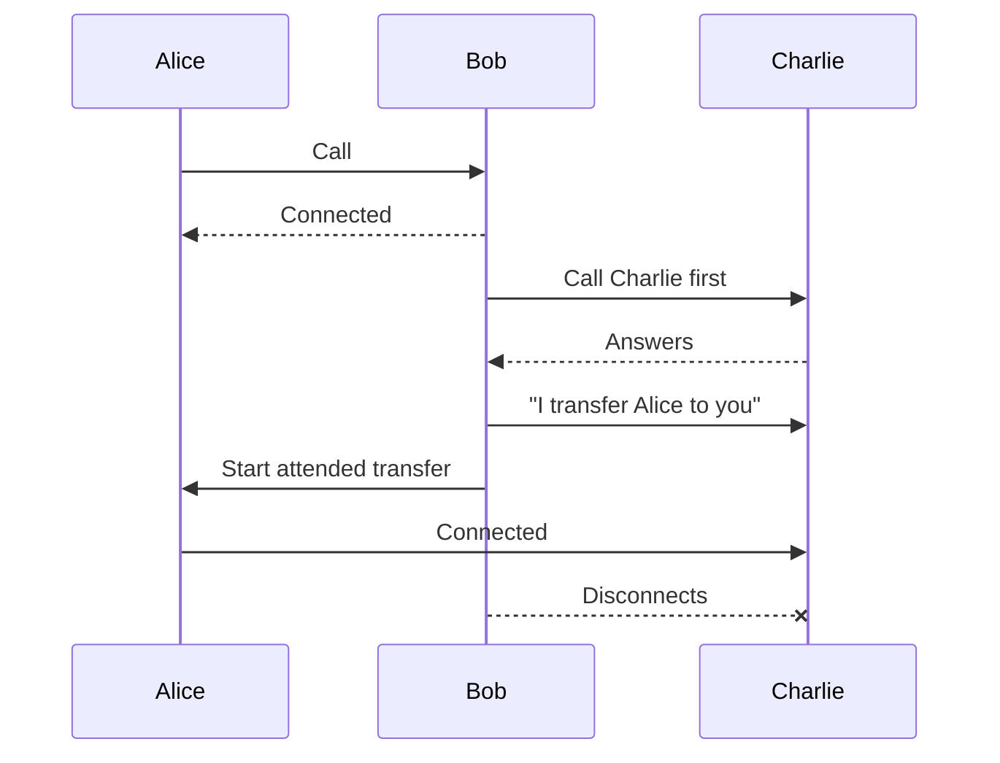
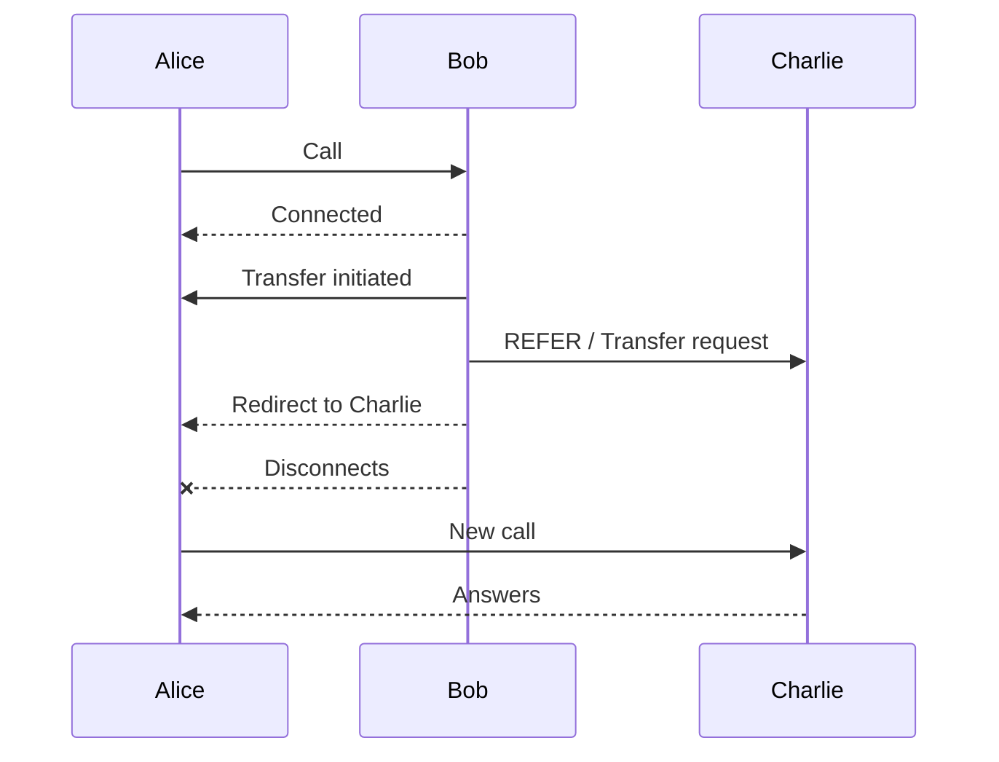

# Configuration options SIP trunk

## Endpoint

### 100rel

`[no|yes|required|peer_supported]` (default: yes)

`100rel` is about **reliable provisional SIP responses**.
Normally, SIP temporary responses like 180 Ringing (“the phone is ringing”) are sent unreliably over UDP.
With 100rel, these temporary responses must be acknowledged with a `PRACK` (Provisional Response Acknowledgement) message, so both sides know they were received. 

`100rel` is about **reliable provisional SIP responses**.
Normally, SIP temporary responses like `180 Ringing` (“the phone is ringing”) are sent unreliably over UDP.
With `100rel`, these temporary responses must be acknowledged with a `PRACK` message, so both sides know they were received.

The different values mean:

* `no`
  Do not support reliable provisional responses at all.

* `yes`
  Support them if the other side wants to use them.

* `required`
  Force the use of reliable provisional responses. Calls may fail if the peer does not support it.

* `peer_supported`
  Use reliable provisional responses only if the other side says it supports them.
  This is usually the safest and most compatible option.

### accept_multiple_sdp_answers

`[yes|no]` (default: no)

`accept_multiple_sdp_answers` allows Asterisk to accept updated SDP information during call setup.

Normally, SIP devices exchange SDP only once to decide:

* which codec to use
* which IP/port to send audio to

But some SIP servers change their media settings during ringing (`18x`) or when the call is answered (`200 OK`).

Example:

* first response → audio should go to port `10000`
* later response → audio should go to port `12000`

With this option enabled, Asterisk accepts the new SDP and updates the media destination.

This is useful with some providers that:

* use a special port for ringback tones
* move RTP streams during the call setup
* change media parameters before the call is fully established

In simple terms:

* Disabled:
  “I only trust the first SDP answer.”

* Enabled:
  “If the remote side changes media information during setup, I accept the update.”

### accountcode

`accountcode` is used to associate calls with a billing or tracking identifier.

When a call is made or received through this endpoint, Asterisk automatically attaches the specified account code to the channel.

This is commonly used for:

* billing
* call reporting
* statistics
* separating departments or customers

Example:

```ini
accountcode = sales
```

All calls from this endpoint will be marked with the account code `sales`.

In simple terms:

* It is like adding a label or tag to calls.
* Useful for tracking who made calls or which group the calls belong to.

### acl

`acl` is used to control which IP addresses are allowed or denied for this endpoint.

It references rules defined in the Asterisk configuration file `acl.conf`.

You can think of it as a firewall rule attached to the SIP endpoint.

Example:

```ini
acl = office_ips, trusted_provider
```

Asterisk will apply the rules from the `office_ips` and `trusted_provider` sections in `acl.conf`.

This is useful to:

* allow only trusted SIP servers or phones
* block unknown IP addresses
* improve security against SIP attacks

In simple terms:

* “Only these IP addresses are allowed to use this endpoint.”

### aggregate_mwi

`[yes|no]` (default: yes)

`aggregate_mwi` controls how voicemail notifications (MWI = Message Waiting Indicator) are sent to the phone.

If a phone monitors multiple mailboxes:

* Enabled (`yes`)
  Asterisk sends one combined notification for all mailboxes.

* Disabled (`no`)
  Asterisk sends one separate notification per mailbox.

Example:

A phone watches:

* mailbox 1000
* mailbox 1001
* mailbox 1002

With `aggregate_mwi=yes`:

* the phone receives one global “you have voicemail” notification.

With `aggregate_mwi=no`:

* the phone receives three individual notifications.

This can affect:

* compatibility with some phones
* network traffic
* how voicemail indicators are displayed

In simple terms:

* Enabled:
  “Group all voicemail notifications together.”

* Disabled:
  “Send one notification per mailbox.”

### allow

`allow` defines which audio codecs this endpoint is allowed to use during calls.

A codec is the format used to encode and compress audio.

Examples of codecs:

* `ulaw`
* `alaw`
* `g722`
* `opus`
* `g729`

Example:

```ini
allow = ulaw,alaw,g722
```

This endpoint can use:

* G.711 µ-law (`ulaw`)
* G.711 A-law (`alaw`)
* G.722 HD audio

During call negotiation, Asterisk and the remote device choose a codec supported by both sides.

This affects:

* audio quality
* bandwidth usage
* CPU usage (transcoding)

In simple terms:

* “These are the audio formats this endpoint accepts.”

[See codecs section](../media/codecs.md)

### allow_overlap

`[yes|no]` (default: yes)

`allow_overlap` enables overlap dialing support.

Normally, SIP sends the full phone number at once.

With overlap dialing, digits can be sent one by one, like on old telephone systems.

Example:

* user dials `1`
* then `10`
* then `100`
* then `1002`

Asterisk receives the number progressively instead of all at once.

This is defined by SIP RFC3578.

This is mainly useful for:

* interoperability with some telecom systems
* old PBX systems
* ISDN-style dialing behavior

Most modern SIP systems do not need this.

In simple terms:

* Disabled:
  “Send the complete number immediately.”

* Enabled:
  “Allow numbers to arrive digit by digit.”

### allow_subscribe

`[yes|no]` (default: yes)

`allow_subscribe` controls whether this endpoint is allowed to send SIP `SUBSCRIBE` requests to Asterisk.

`SUBSCRIBE` is used to ask for status updates.

Common examples:

* BLF (Busy Lamp Field)
* extension presence
* voicemail status
* phone status monitoring

Example:

* a phone subscribes to extension `1001`
* Asterisk sends notifications when `1001` becomes busy, ringing, or available

If disabled:

* the endpoint cannot monitor statuses through subscriptions

This is commonly used for:

* receptionist phones
* sidecar/BLF buttons
* presence features

In simple terms:

* Enabled:
  “This phone can ask Asterisk for status updates.”

* Disabled:
  “This phone is not allowed to monitor statuses.”

### allow_transfer

`[yes|no]` (default: yes)

`allow_transfer` controls whether this endpoint is allowed to use SIP call transfers with the `REFER` method.

A SIP `REFER` tells another device:

* “Please call this other number instead.”

This is how many SIP phones perform call transfers.

Example:

* Alice calls Bob
* Bob transfers Alice to Charlie
* Bob sends a SIP `REFER`

If enabled:

* the endpoint can perform SIP transfers

If disabled:

* transfer requests are rejected

This affects:

* attended transfers (consult the recipient before transferring the call)



* blind transfers (immediate transfer, no verification)



* interoperability with SIP phones/providers

In simple terms:

* Enabled:
  “This endpoint can transfer calls.”

* Disabled:
  “This endpoint cannot use SIP transfers.”

### allow_unauthenticated_options

`[yes|no]` (default: no)

`allow_unauthenticated_options` controls whether Asterisk accepts SIP `OPTIONS` requests without authentication.

`OPTIONS` is often used like a SIP “ping” to check:

* if a device is online
* if a SIP endpoint is reachable
* if the service is alive

Some SIP phones and providers expect a simple `200 OK` response without needing authentication.

If enabled:

* Asterisk answers `OPTIONS` requests even from unauthenticated sources

If disabled:

* authentication is required before answering

This improves compatibility with some SIP providers and monitoring systems.

However, there is a security risk:

* attackers may discover valid endpoint names
* they can scan your SIP server more easily

In simple terms:

* Enabled:
  “Anyone can ping this SIP endpoint.”

* Disabled:
  “You must authenticate before Asterisk answers OPTIONS requests.”

### aors

`aors` links a SIP endpoint to one or more AoRs (Address of Record).

An AoR represents where the endpoint can currently be reached.

It usually contains:

* the SIP contact address
* registered device locations
* IP addresses or SIP URIs

Example:

```ini
aors = phone1001
```

The endpoint uses the `phone1001` AoR to know where calls should be sent.

When a phone registers:

* the AoR stores its current contact address

Asterisk then uses the AoR to route calls to the correct device.

In simple terms:

* Endpoint = “who the device is”
* AoR = “where the device is currently reachable”

### asymmetric_rtp_codec

`[yes|no]` (default: no)

`asymmetric_rtp_codec` allows Asterisk to use different codecs for sending and receiving audio.

Normally, SIP tries to use the same codec in both directions.

Example (normal behavior):

* receive audio with `ulaw`
* send audio with `ulaw`

With this option enabled:

* receive audio with `opus`
* send audio with `g722`

Asterisk will not automatically switch its sending codec to match the received codec.

This can be useful with:

* unusual SIP devices
* some gateways/providers
* asymmetric media environments

But it may also:

* increase transcoding
* increase CPU usage
* create compatibility issues with some devices

In simple terms:

* Disabled:
  “Use the same codec in both directions.”

* Enabled:
  “Sending and receiving codecs may be different.”

### auth

`auth` defines which authentication rules are used to verify incoming SIP connections for this endpoint.

It references one or more `auth` sections defined elsewhere in `pjsip.conf`.

Example:

```ini
auth = phone1001-auth
```

When a SIP device tries to:

* register
* make a call
* connect to Asterisk

Asterisk checks the credentials using this authentication section.

Typically, the auth section contains:

* username
* password
* authentication method

If no `auth` is configured:

* the endpoint may accept connections without authentication
  (which is usually insecure)

In simple terms:

* “These are the login credentials required for this endpoint.”

### bind_rtp_to_media_address

`[yes|no]` (default: no)

`bind_rtp_to_media_address` controls which local IP address Asterisk uses to send RTP audio packets.

Normally, Asterisk automatically chooses the source IP address for audio traffic.

If `media_address` is configured and this option is enabled:

* RTP packets are explicitly sent from that IP address

This is especially useful on servers with:

* multiple network interfaces
* multiple public IPs
* NAT configurations

Example:

```ini
media_address = 34.53.141.129
bind_rtp_to_media_address = yes
```

Audio packets will be sent from `34.53.141.129`.

This helps avoid:

* one-way audio
* NAT problems
* incorrect RTP source IPs

In simple terms:

* Disabled:
  “Asterisk chooses the RTP source IP automatically.”

* Enabled:
  “Force RTP audio to be sent from the media_address IP.”

### bundle

`[yes|no]` (default: no)

`bundle` enables RTP bundling.

Normally, each media stream uses its own transport/port.

Example without bundle:

* audio RTP → port 10000
* video RTP → port 10002
* screen sharing → another port

With `bundle` enabled:

* multiple media streams share the same transport and port

This reduces:

* the number of UDP ports used
* network complexity
* NAT traversal issues

This feature is commonly used with:

* WebRTC
* modern browsers
* multimedia SIP sessions

When enabled, Asterisk also automatically enables `rtcp_mux`:

* RTP and RTCP will share the same port too

In simple terms:

* Disabled:
  “Each media stream uses separate ports.”

* Enabled:
  “Multiple media streams can share the same connection.”

### call_group

`call_group` assigns this endpoint to one or more call groups.

Call groups are used with pickup features:

* a phone can answer calls ringing in the same group

Example:

```ini
call_group = 1,3,10-12
```

This endpoint belongs to:

* group 1
* group 3
* groups 10 to 12

If another phone is allowed to pick up calls from these groups:

* it can answer ringing calls remotely

This is commonly used in:

* offices
* support teams
* reception environments

Example:

* Alice’s phone rings
* Bob is in the same pickup group
* Bob presses “pickup” and answers Alice’s call

In simple terms:

* “This endpoint belongs to these call pickup groups.”

### callerid

`callerid` defines the caller identity sent by this endpoint.

It usually contains:

* a display name
* a phone number

Format:

```ini
callerid = "Alice Smith" <1001>
```

When this endpoint makes a call:

* the called person may see:

  * `Alice Smith`
  * `1001`

You can also define only a number:

```ini
callerid = <1001>
```

Or only a name:

```ini
callerid = "Support Desk"
```

This affects:

* what appears on phones
* outbound caller identification
* call logs and displays

In simple terms:

* “This is the name and number shown during calls.”

### callerid_privacy

`callerid_privacy` defines the privacy level of the caller ID.

It tells the remote side whether:

* the caller ID can be shown
* the caller ID should be hidden
* the caller ID has been verified (“screened”)

The most common values are:

* `allowed`
  Caller ID may be displayed normally.

* `prohib`
  Caller ID should be hidden/private.

* `unavailable`
  Caller ID information is unavailable.

The “screened” variants indicate whether the caller ID was verified by the network:

* `passed_screen`
  The caller ID was verified.

* `failed_screen`
  Verification failed.

* `not_screened`
  No verification was performed.

Examples:

```ini
callerid_privacy = allowed
```

→ show the caller ID normally.

```ini
callerid_privacy = prohib
```

→ request anonymous/private caller ID.

In simple terms:

* “Should the caller ID be visible or hidden, and is it trusted?”

### callerid_tag

`callerid_tag` is an internal label attached to the endpoint’s caller ID.

It is mainly used internally by Asterisk for identification or custom logic.

Unlike `callerid`, this value is usually not shown to users during calls.

Example:

```ini
callerid_tag = sales_team
```

This can help:

* identify groups of endpoints
* apply custom dialplan logic
* simplify debugging or integrations

In simple terms:

* “An internal tag associated with this endpoint’s caller ID.”

### codec_prefs_incoming_answer

default : prefer: pending, operation: intersect, keep: all

The string actually specifies 4 'name:value' pair parameters separated by commas.

`codec_prefs_incoming_answer` controls how Asterisk chooses codecs when it receives an SDP answer from the remote side.

In SIP, both sides exchange codec lists during call setup.

Example:

Asterisk supports:

* `opus`
* `g722`
* `ulaw`

The remote device answers with:

* `ulaw`
* `alaw`

This option tells Asterisk:

* which list is preferred
* how to combine the lists
* whether to keep one codec or several

The important parameters are:

* `prefer`
  Which codec list has priority:

  * `pending` → prefer the remote SDP codecs
  * `configured` → prefer the endpoint codecs

* `operation`
  How to combine codec lists:

  * `intersect` → keep only codecs supported by both sides
  * `union` → merge both lists
  * `only_preferred` → keep only the preferred list

* `keep`
  How many codecs to keep:

  * `all` → keep all matching codecs
  * `first` → keep only the first codec

Example:

```ini
codec_prefs_incoming_answer = keep:first
```

Meaning:

* negotiate codecs normally
* but finally keep only the first selected codec

In simple terms:

* “This option controls how Asterisk chooses and prioritizes codecs when the remote side answers the call.”

### codec_prefs_incoming_offer

default: prefer: pending, operation: intersect, keep: all, transcode: allow

`codec_prefs_incoming_offer` controls how Asterisk handles codecs proposed by the remote side when receiving a call.

When an incoming SIP call arrives, the caller sends an SDP offer containing supported codecs.

Example:

Caller offers:

* `opus`
* `ulaw`
* `g729`

Endpoint configuration allows:

* `g722`
* `ulaw`
* `alaw`

This option tells Asterisk:

* which codec list has priority
* how to compare both lists
* whether transcoding is allowed

The main parameters are:

* `prefer`
  Which codec order should be preferred:

  * `pending` → prefer the caller’s codec order
  * `configured` → prefer the endpoint codec order

* `operation`
  How to compare the codec lists:

  * `intersect` → keep only codecs supported by both sides
  * `only_preferred` → keep only the preferred list

* `keep`
  How many codecs to keep:

  * `all` → keep all matching codecs
  * `first` → keep only the first codec

* `transcode`
  Whether transcoding is allowed:

  * `allow` → Asterisk may convert codecs
  * `prevent` → avoid codec conversion

Example:

```ini
codec_prefs_incoming_offer = prefer:pending, operation:intersect, keep:all
```

Meaning:

* prefer the caller’s codec order
* keep only codecs supported by both sides
* keep all compatible codecs

In simple terms:

* “This option controls how Asterisk chooses codecs when someone calls you.”

### codec_prefs_outgoing_answer

default: prefer: pending, operation: intersect, keep: all

`codec_prefs_outgoing_answer` controls how Asterisk chooses codecs when answering an outgoing SIP negotiation.

This happens when:

* Asterisk sends an SDP answer
* after receiving an SDP offer from the remote side

The option decides how to combine:

* codecs proposed by the Asterisk core (`pending`)
* codecs configured on the endpoint (`configured`)

Example:

Asterisk core proposes:

* `opus`
* `ulaw`

Endpoint allows:

* `g722`
* `ulaw`

This option determines:

* which list has priority
* which codecs are kept
* in which order

The important parameters are:

* `prefer`
  Which codec list should have priority:

  * `pending` → prefer codecs from the Asterisk core
  * `configured` → prefer endpoint codecs

* `operation`
  How to combine codec lists:

  * `intersect` → keep only codecs supported by both sides
  * `union` → merge codec lists
  * `only_preferred` → keep only the preferred list

* `keep`
  How many codecs remain:

  * `all` → keep all compatible codecs
  * `first` → keep only the first codec

Example:

```ini id="4vt8yx"
codec_prefs_outgoing_answer = keep:first
```

Meaning:

* process codecs normally
* but finally keep only the first selected codec

In simple terms:

* “This option controls which codecs Asterisk sends back when negotiating an outgoing call.”

### codec_prefs_outgoing_offer

default: prefer: prefer: pending, operation: union, keep: all, transcode: allow

codec_prefs_outgoing_offer¶
Since: 18.0.0

This is a string that describes how the codecs specified in the topology that comes from the Asterisk core (pending) are reconciled with the codecs specified on an endpoint (configured) when sending an SDP offer. The string actually specifies 4 'name:value' pair parameters separated by commas. Whitespace is ignored and they may be specified in any order. Note that this option is reserved for future functionality.

Parameters:

prefer: < pending | configured > -

pending - The codec list from the core. (default)

configured - The codec list from the endpoint.

operation : < union | intersect | only_preferred | only_nonpreferred > -

union - Merge the lists with the preferred codecs first. (default)

intersect - Only common codecs with the preferred codecs first. (default)

only_preferred - Use only the preferred codecs.

only_nonpreferred - Use only the non-preferred codecs.

keep : < all | first > -

all - After the operation, keep all codecs. (default)

first - After the operation, keep only the first codec.

transcode : < allow | prevent > -

allow - Allow transcoding. (default)

prevent - Prevent transcoding.


Example:

codec_prefs_outgoing_offer = prefer: configured, operation: union, keep: first, transcode: prevent
Prefer the codecs coming from the endpoint. Merge them with the codecs from the core keeping the order of the preferred list. Keep only the first one. No transcoding allowed.

### connected_line_method

